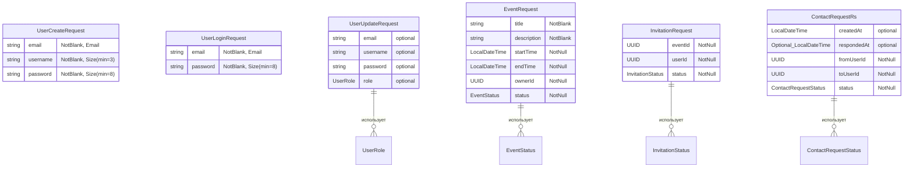
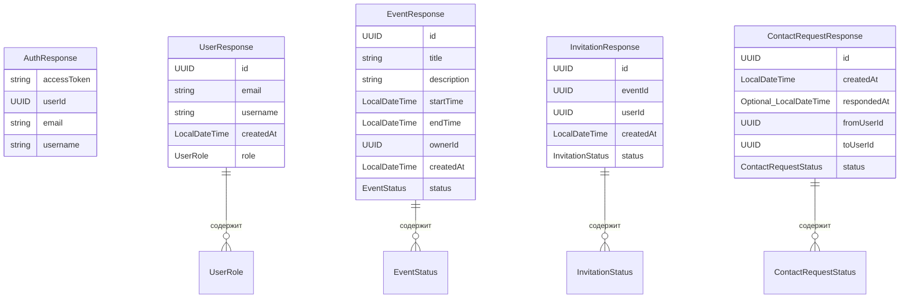
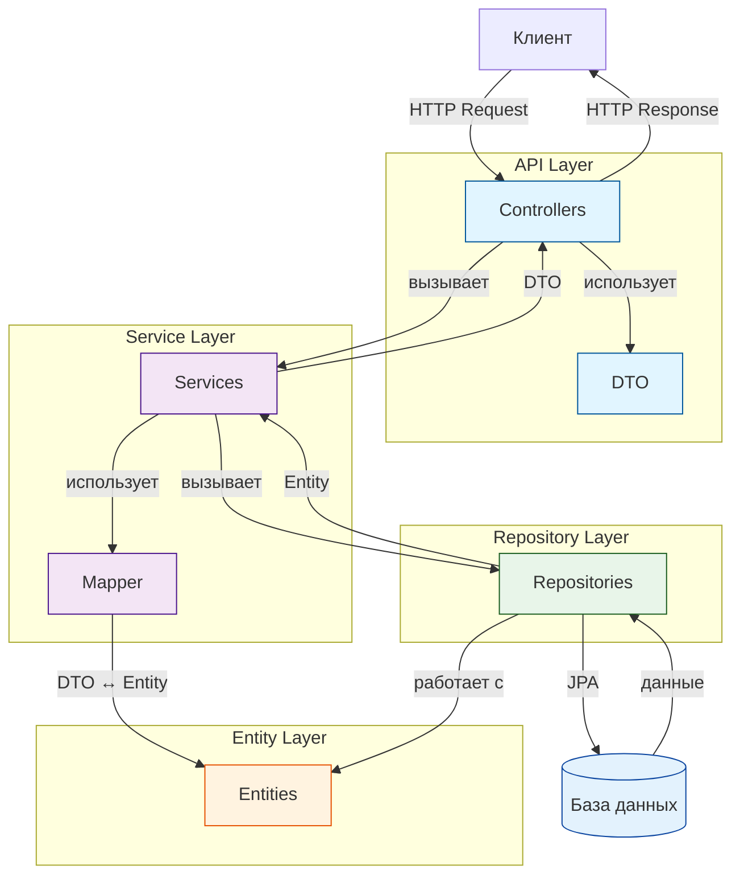

# Описание приложения "Календарь событий"

## Краткое описание приложения (что уже реализовано)

Веб-приложение для управления календарем событий с системой приглашений и контактов. Приложение представляет собой полнофункциональную систему для организации и управления событиями с возможностью приглашения других пользователей.

### Реализованный функционал:

1. **Система аутентификации и авторизации:**
   - Регистрация новых пользователей
   - Вход в систему (логин/пароль)
   - JWT-аутентификация с использованием access и refresh токенов
   - Автоматическое обновление токенов
   - Выход из системы
   - Режим "nopass" для разработки (автоматический вход как администратор)

2. **Управление событиями:**
   - Создание событий с указанием названия, описания, времени начала и окончания
   - Просмотр всех событий и событий конкретного пользователя
   - Редактирование существующих событий
   - Удаление событий
   - Статусы событий (активные, завершенные и т.д.)

3. **Система приглашений:**
   - Создание приглашений на события для других пользователей
   - Просмотр входящих приглашений
   - Обновление статуса приглашений (принято/отклонено)
   - Удаление приглашений
   - Фильтрация приглашений по статусу

4. **Управление контактами:**
   - Отправка запросов на добавление в контакты
   - Просмотр входящих и исходящих запросов на контакты
   - Принятие/отклонение запросов на добавление в контакты
   - Удаление контактов

5. **Профиль пользователя:**
   - Просмотр информации о текущем пользователе
   - Редактирование профиля (имя пользователя, email)

6. **Административная панель:**
   - Просмотр списка всех пользователей (только для администраторов)
   - Изменение ролей пользователей
   - Управление пользователями системы

7. **Дополнительные возможности:**
   - RESTful API с документацией Swagger/OpenAPI
   - Адаптивный пользовательский интерфейс
   - Защищенные маршруты (требуется аутентификация)
   - Валидация данных на клиенте и сервере

## Технологии клиентской и серверной части

### Серверная часть (Backend):

- **Фреймворк:** Spring Boot 4.0.1
- **Язык программирования:** Java 21
- **База данных:**
  - PostgreSQL (для продакшена)
  - H2 Database (для разработки)
- **ORM:** Spring Data JPA / Hibernate
- **Безопасность:** Spring Security с JWT-аутентификацией
- **Миграции БД:** Liquibase
- **Валидация:** Jakarta Validation (Bean Validation)
- **API документация:** SpringDoc OpenAPI (Swagger) 2.6.0
- **JWT библиотека:** jjwt 0.12.5
- **Сборка:** Maven
- **Архитектура:** RESTful API

### Клиентская часть (Frontend):

- **Фреймворк:** React 19.2.0
- **Язык программирования:** TypeScript 5.9.3
- **Сборщик:** Vite 7.2.4
- **UI библиотека:** Mantine 8.3.10
  - @mantine/core
  - @mantine/dates (календарь)
  - @mantine/form
  - @mantine/hooks
  - @mantine/modals
  - @mantine/notifications
- **Стилизация:** Tailwind CSS 4.1.18
- **Управление состоянием и запросами:** TanStack React Query 5.90.12
- **Маршрутизация:** React Router 7.11.0
- **Валидация форм:** Zod 4.2.1 + mantine-form-zod-resolver
- **Работа с датами:** dayjs 1.11.19
- **SEO и мета-теги:** @unhead/react 2.0.19
- **Линтинг:** ESLint 9.39.1

### Инфраструктура:

- **Контейнеризация:** Docker (docker-compose.yml)
- **Версионирование БД:** Liquibase changelog
- **Профили приложения:** dev, prod, nopass

## Для кого предназначено приложение (пользователи, роли)

### Роли пользователей:

1. **USER (Обычный пользователь):**
   - Регистрация и вход в систему
   - Создание, просмотр, редактирование и удаление своих событий
   - Создание приглашений на свои события для других пользователей
   - Просмотр и управление входящими приглашениями (принятие/отклонение)
   - Отправка запросов на добавление в контакты
   - Управление своими контактами (принятие/отклонение запросов)
   - Просмотр и редактирование своего профиля

2. **ADMIN (Администратор):**
   - Все возможности обычного пользователя (USER)
   - Доступ к административной панели
   - Просмотр списка всех пользователей системы
   - Изменение ролей пользователей (назначение/снятие роли администратора)
   - Управление пользователями системы

### Целевая аудитория:

Приложение предназначено для:
- **Индивидуальных пользователей** - для личного планирования и организации событий
- **Команд и групп** - для совместного планирования мероприятий через систему приглашений
- **Организаторов мероприятий** - для создания событий и приглашения участников
- **Администраторов системы** - для управления пользователями и поддержания работоспособности системы

### Сценарии использования:

1. **Личное планирование:** Пользователь создает события для себя, управляет своим календарем
2. **Совместные мероприятия:** Создатель события приглашает других пользователей, которые могут принять или отклонить приглашение
3. **Сетевые взаимодействия:** Пользователи могут добавлять друг друга в контакты для упрощения процесса приглашения
4. **Административное управление:** Администраторы контролируют пользовательскую базу и управляют правами доступа

## ER-диаграммы DTO

### ER-диаграмма для Request DTO



## Подробное описание DTO

### Request DTO (DTO для входящих запросов)

#### 1. UserCreateRequest
**Назначение:** Запрос на регистрацию нового пользователя в системе  
**Используется в:** `POST /api/auth/register`

| Поле | Тип | Валидация | Описание |
|------|-----|-----------|----------|
| `email` | `String` | `@NotBlank`, `@Email` | Email адрес пользователя. Должен быть уникальным в системе |
| `username` | `String` | `@NotBlank`, `@Size(min=3)` | Имя пользователя. Минимум 3 символа |
| `password` | `String` | `@NotBlank`, `@Size(min=8)` | Пароль пользователя. Минимум 8 символов. Хранится в БД как хэш |

**Пример JSON:**
```json
{
  "email": "user@example.com",
  "username": "john_doe",
  "password": "securepass123"
}
```

---

#### 2. UserLoginRequest
**Назначение:** Запрос на авторизацию пользователя  
**Используется в:** `POST /api/auth/login`

| Поле | Тип | Валидация | Описание |
|------|-----|-----------|----------|
| `email` | `String` | `@NotBlank`, `@Email` | Email адрес для входа |
| `password` | `String` | `@NotBlank`, `@Size(min=8)` | Пароль пользователя |

**Пример JSON:**
```json
{
  "email": "user@example.com",
  "password": "securepass123"
}
```

---

#### 3. UserUpdateRequest
**Назначение:** Запрос на обновление данных пользователя  
**Используется в:** `PUT /api/users/{id}` (для администраторов)

| Поле | Тип | Валидация | Описание |
|------|-----|-----------|----------|
| `email` | `String` | Опционально | Новый email адрес |
| `username` | `String` | Опционально | Новое имя пользователя |
| `password` | `String` | Опционально | Новый пароль (будет захеширован) |
| `role` | `UserRole` | Опционально | Роль пользователя: `ADMIN` или `USER` |

**Примечание:** Все поля опциональны. Обновляются только переданные поля.

**Пример JSON:**
```json
{
  "email": "newemail@example.com",
  "username": "new_username",
  "role": "ADMIN"
}
```

---

#### 4. EventRequest
**Назначение:** Запрос на создание или обновление события  
**Используется в:** `POST /api/events`, `PUT /api/events/{id}`

| Поле | Тип | Валидация | Описание |
|------|-----|-----------|----------|
| `title` | `String` | `@NotBlank` | Название события |
| `description` | `String` | `@NotBlank` | Подробное описание события |
| `startTime` | `LocalDateTime` | `@NotNull` | Дата и время начала события в формате ISO-8601 |
| `endTime` | `LocalDateTime` | `@NotNull`, `@ValidEventTime` | Дата и время окончания события. Должно быть после `startTime` |
| `ownerId` | `UUID` | `@NotNull` | UUID пользователя-владельца события |
| `status` | `EventStatus` | `@NotNull` | Статус события: `DRAFT` (черновик), `PUBLISHED` (опубликовано), `CANCELLED` (отменено) |

**Пример JSON:**
```json
{
  "title": "Встреча команды",
  "description": "Обсуждение проекта",
  "startTime": "2024-12-20T10:00:00",
  "endTime": "2024-12-20T11:30:00",
  "ownerId": "123e4567-e89b-12d3-a456-426614174000",
  "status": "PUBLISHED"
}
```

---

#### 5. InvitationRequest
**Назначение:** Запрос на создание или обновление приглашения на событие  
**Используется в:** `POST /api/invitations`, `PUT /api/invitations/{id}`

| Поле | Тип | Валидация | Описание |
|------|-----|-----------|----------|
| `eventId` | `UUID` | `@NotNull` | UUID события, на которое отправляется приглашение |
| `userId` | `UUID` | `@NotNull` | UUID пользователя, которому отправляется приглашение |
| `status` | `InvitationStatus` | `@NotNull` | Статус приглашения: `PENDING` (ожидает), `ACCEPTED` (принято), `REJECTED` (отклонено) |

**Пример JSON:**
```json
{
  "eventId": "123e4567-e89b-12d3-a456-426614174000",
  "userId": "987e6543-e21b-43d2-b654-321987654321",
  "status": "PENDING"
}
```

---

#### 6. ContactRequestRs
**Назначение:** Запрос на создание или обновление запроса на добавление в контакты  
**Используется в:** `POST /api/contacts`, `PUT /api/contacts/{id}`

| Поле | Тип | Валидация | Описание |
|------|-----|-----------|----------|
| `createdAt` | `LocalDateTime` | Опционально | Дата создания запроса (обычно устанавливается автоматически) |
| `respondedAt` | `Optional<LocalDateTime>` | Опционально | Дата ответа на запрос. Заполняется при принятии/отклонении |
| `fromUserId` | `UUID` | `@NotNull` | UUID пользователя, отправляющего запрос |
| `toUserId` | `UUID` | `@NotNull` | UUID пользователя, которому отправляется запрос |
| `status` | `ContactRequestStatus` | `@NotNull` | Статус запроса: `PENDING` (ожидает), `ACCEPTED` (принято), `REJECTED` (отклонено) |

**Пример JSON:**
```json
{
  "fromUserId": "123e4567-e89b-12d3-a456-426614174000",
  "toUserId": "987e6543-e21b-43d2-b654-321987654321",
  "status": "PENDING"
}
```

### ER-диаграмма для Response DTO



### Response DTO (DTO для исходящих ответов)

#### 1. AuthResponse
**Назначение:** Ответ на успешную авторизацию или обновление токена  
**Используется в:** `POST /api/auth/login`, `POST /api/auth/refresh`

| Поле | Тип | Описание |
|------|-----|----------|
| `accessToken` | `String` | JWT access токен для аутентификации в последующих запросах. Передается в заголовке `Authorization: Bearer {token}` |
| `userId` | `UUID` | Уникальный идентификатор пользователя |
| `email` | `String` | Email адрес пользователя |
| `username` | `String` | Имя пользователя |

**Пример JSON:**
```json
{
  "accessToken": "eyJhbGciOiJIUzI1NiIsInR5cCI6IkpXVCJ9...",
  "userId": "123e4567-e89b-12d3-a456-426614174000",
  "email": "user@example.com",
  "username": "john_doe"
}
```

---

#### 2. UserResponse
**Назначение:** Ответ с данными пользователя  
**Используется в:** `GET /api/users`, `GET /api/users/{id}`, `GET /api/auth/me`

| Поле | Тип | Описание |
|------|-----|----------|
| `id` | `UUID` | Уникальный идентификатор пользователя |
| `email` | `String` | Email адрес пользователя |
| `username` | `String` | Имя пользователя |
| `createdAt` | `LocalDateTime` | Дата и время создания аккаунта в формате ISO-8601 |
| `role` | `UserRole` | Роль пользователя: `ADMIN` (администратор) или `USER` (обычный пользователь) |

**Примечание:** Пароль (`passwordHash`) никогда не возвращается в ответе по соображениям безопасности.

**Пример JSON:**
```json
{
  "id": "123e4567-e89b-12d3-a456-426614174000",
  "email": "user@example.com",
  "username": "john_doe",
  "createdAt": "2024-01-15T10:30:00",
  "role": "USER"
}
```

---

#### 3. EventResponse
**Назначение:** Ответ с данными события  
**Используется в:** `GET /api/events`, `GET /api/events/{id}`, `GET /api/events/user/{userId}`, `POST /api/events`, `PUT /api/events/{id}`

| Поле | Тип | Описание |
|------|-----|----------|
| `id` | `UUID` | Уникальный идентификатор события |
| `title` | `String` | Название события |
| `description` | `String` | Подробное описание события |
| `startTime` | `LocalDateTime` | Дата и время начала события в формате ISO-8601 |
| `endTime` | `LocalDateTime` | Дата и время окончания события в формате ISO-8601 |
| `ownerId` | `UUID` | UUID пользователя-владельца события |
| `createdAt` | `LocalDateTime` | Дата и время создания события в формате ISO-8601 |
| `status` | `EventStatus` | Статус события: `DRAFT` (черновик), `PUBLISHED` (опубликовано), `CANCELLED` (отменено) |

**Пример JSON:**
```json
{
  "id": "456e7890-e12b-34d5-b789-567890123456",
  "title": "Встреча команды",
  "description": "Обсуждение проекта",
  "startTime": "2024-12-20T10:00:00",
  "endTime": "2024-12-20T11:30:00",
  "ownerId": "123e4567-e89b-12d3-a456-426614174000",
  "createdAt": "2024-12-15T09:00:00",
  "status": "PUBLISHED"
}
```

---

#### 4. InvitationResponse
**Назначение:** Ответ с данными приглашения на событие  
**Используется в:** `GET /api/invitations`, `GET /api/invitations/{id}`, `GET /api/invitations/user/{userId}`, `POST /api/invitations`, `PUT /api/invitations/{id}`

| Поле | Тип | Описание |
|------|-----|----------|
| `id` | `UUID` | Уникальный идентификатор приглашения |
| `eventId` | `UUID` | UUID события, на которое отправлено приглашение |
| `userId` | `UUID` | UUID пользователя, которому отправлено приглашение |
| `createdAt` | `LocalDateTime` | Дата и время создания приглашения в формате ISO-8601 |
| `status` | `InvitationStatus` | Статус приглашения: `PENDING` (ожидает ответа), `ACCEPTED` (принято), `REJECTED` (отклонено) |

**Пример JSON:**
```json
{
  "id": "789e0123-e45b-67d8-c901-234567890123",
  "eventId": "456e7890-e12b-34d5-b789-567890123456",
  "userId": "987e6543-e21b-43d2-b654-321987654321",
  "createdAt": "2024-12-16T14:00:00",
  "status": "PENDING"
}
```

---

#### 5. ContactRequestResponse
**Назначение:** Ответ с данными запроса на добавление в контакты  
**Используется в:** `GET /api/contacts`, `GET /api/contacts/{id}`, `GET /api/contacts/user/{userId}`, `POST /api/contacts`, `PUT /api/contacts/{id}`

| Поле | Тип | Описание |
|------|-----|----------|
| `id` | `UUID` | Уникальный идентификатор запроса на контакт |
| `createdAt` | `LocalDateTime` | Дата и время создания запроса в формате ISO-8601 |
| `respondedAt` | `Optional<LocalDateTime>` | Дата и время ответа на запрос. Присутствует только если запрос был принят или отклонен |
| `fromUserId` | `UUID` | UUID пользователя, отправившего запрос |
| `toUserId` | `UUID` | UUID пользователя, которому отправлен запрос |
| `status` | `ContactRequestStatus` | Статус запроса: `PENDING` (ожидает ответа), `ACCEPTED` (принято), `REJECTED` (отклонено) |

**Пример JSON:**
```json
{
  "id": "012e3456-e78b-90d1-e234-567890123456",
  "createdAt": "2024-12-17T08:00:00",
  "respondedAt": null,
  "fromUserId": "123e4567-e89b-12d3-a456-426614174000",
  "toUserId": "987e6543-e21b-43d2-b654-321987654321",
  "status": "PENDING"
}
```

**Пример JSON (после ответа):**
```json
{
  "id": "012e3456-e78b-90d1-e234-567890123456",
  "createdAt": "2024-12-17T08:00:00",
  "respondedAt": "2024-12-17T10:30:00",
  "fromUserId": "123e4567-e89b-12d3-a456-426614174000",
  "toUserId": "987e6543-e21b-43d2-b654-321987654321",
  "status": "ACCEPTED"
}
```

### Связи между DTO и сущностями

**Request DTO используются для:**
- Валидации входящих данных от клиента
- Преобразования в сущности (Entity) для сохранения в БД
- Обработки обновлений существующих записей

**Response DTO используются для:**
- Возврата данных клиенту в структурированном виде
- Исключения чувствительных данных (например, passwordHash)
- Предоставления только необходимых полей для клиента

### Enum типы, используемые в DTO

#### UserRole
Роль пользователя в системе.

| Значение | Описание |
|----------|----------|
| `ADMIN` | Администратор системы. Имеет доступ к административной панели и может управлять пользователями |
| `USER` | Обычный пользователь. Базовые права на создание и управление событиями, приглашениями и контактами |

**Используется в:** `UserUpdateRequest`, `UserResponse`

---

#### EventStatus
Статус события в календаре.

| Значение | Описание |
|----------|----------|
| `DRAFT` | Черновик. Событие создано, но еще не опубликовано |
| `PUBLISHED` | Опубликовано. Событие активно и видно другим пользователям |
| `CANCELLED` | Отменено. Событие было отменено владельцем |

**Используется в:** `EventRequest`, `EventResponse`

---

#### InvitationStatus
Статус приглашения на событие.

| Значение | Описание |
|----------|----------|
| `PENDING` | Ожидает ответа. Приглашение отправлено, но пользователь еще не ответил |
| `ACCEPTED` | Принято. Пользователь принял приглашение |
| `REJECTED` | Отклонено. Пользователь отклонил приглашение |

**Используется в:** `InvitationRequest`, `InvitationResponse`

---

#### ContactRequestStatus
Статус запроса на добавление в контакты.

| Значение | Описание |
|----------|----------|
| `PENDING` | Ожидает ответа. Запрос отправлен, но получатель еще не ответил |
| `ACCEPTED` | Принято. Получатель принял запрос, пользователи стали контактами |
| `REJECTED` | Отклонено. Получатель отклонил запрос |

**Используется в:** `ContactRequestRs`, `ContactRequestResponse`

---

### Типы данных

| Тип | Описание | Пример |
|-----|----------|--------|
| `UUID` | Уникальный идентификатор (java.util.UUID) | `"123e4567-e89b-12d3-a456-426614174000"` |
| `LocalDateTime` | Дата и время в формате ISO-8601 (java.time.LocalDateTime) | `"2024-12-20T10:00:00"` |
| `String` | Строковые значения | `"Текст"` |
| `Optional<T>` | Опциональное значение (java.util.Optional). Может быть `null` или содержать значение типа `T` | `Optional<LocalDateTime>` - может быть `null` или содержать дату |

---

### Связи между DTO и сущностями

**Request DTO используются для:**
- Валидации входящих данных от клиента перед обработкой
- Преобразования в сущности (Entity) для сохранения в базе данных
- Обработки обновлений существующих записей (частичное обновление через опциональные поля)

**Response DTO используются для:**
- Возврата данных клиенту в структурированном и безопасном виде
- Исключения чувствительных данных (например, `passwordHash` никогда не возвращается)
- Предоставления только необходимых полей для клиента
- Стандартизации формата ответов API

**Принципы работы:**
1. Все входящие данные валидируются через аннотации Jakarta Validation
2. Пароли никогда не возвращаются в Response DTO
3. UUID используются для всех идентификаторов для обеспечения уникальности
4. Enum типы обеспечивают типобезопасность и ограничивают допустимые значения

## Схема маршрутизации клиентской части

Клиентская часть приложения использует **React Router v7** для управления маршрутизацией. Приложение разделено на публичные и защищенные маршруты с использованием компонентов-оберток для контроля доступа.

### Структура маршрутизации

```mermaid
graph TD
    A[Корневой маршрут /] --> B{Проверка авторизации}
    B -->|Не авторизован| C[PublicRoute]
    B -->|Авторизован| D[ProtectedRoute]
    
    C --> E[/login - LoginPage]
    C --> F[/register - RegisterPage]
    
    D --> G[AppLayout]
    G --> H[/profile - ProfilePage]
    G --> I[/events - EventsPage]
    G --> J[/events/:id - EventPage]
    G --> K[/invitations - InvintationsPage]
    G --> L[/contacts - ContactsPage]
    G --> M[/admin/users - AdminUsersPage]
    
    N[Неизвестный маршрут *] --> O[ErrorPage]
```

### Типы маршрутов

#### 1. Публичные маршруты (PublicRoute)

**Компонент:** `PublicRoute`  
**Логика защиты:** Если пользователь уже авторизован (есть токен и данные пользователя), происходит автоматический редирект на главную страницу (`/`)

**Маршруты:**

| Путь | Компонент | Layout | Описание |
|------|-----------|--------|----------|
| `/login` | `LoginPage` | `DefaultLayout` | Страница входа в систему. Доступна только неавторизованным пользователям |
| `/register` | `RegisterPage` | `DefaultLayout` | Страница регистрации. Доступна только неавторизованным пользователям |

**Особенности:**
- Используют `DefaultLayout` - минималистичный layout с простым заголовком
- При наличии токена происходит редирект на `/`
- Не требуют авторизации для доступа

---

#### 2. Защищенные маршруты (ProtectedRoute)

**Компонент:** `ProtectedRoute`  
**Логика защиты:**
1. Проверяет наличие access token в локальном хранилище
2. Если токена нет, пытается обновить его через refresh token из cookie
3. Если обновление не удалось или токен недействителен, редиректит на `/login`
4. Показывает loader во время проверки авторизации
5. При успешной авторизации отображает контент

**Layout:** `AppLayout` - основной layout приложения с:
- Навигационным меню (sidebar)
- Заголовком с информацией о пользователе
- Автоматическим обновлением токенов

**Маршруты:**

| Путь | Компонент | Описание | Требования |
|------|-----------|----------|------------|
| `/` | `Navigate to /profile` | Корневой маршрут, редиректит на профиль | Авторизация |
| `/profile` | `ProfilePage` | Страница профиля пользователя. Просмотр и редактирование данных | Авторизация |
| `/events` | `EventsPage` | Список всех событий. Создание, просмотр, редактирование событий | Авторизация |
| `/events/:id` | `EventPage` | Детальная страница события с параметром `id` (UUID события) | Авторизация |
| `/invitations` | `InvintationsPage` | Страница приглашений. Просмотр входящих приглашений, управление статусами | Авторизация |
| `/contacts` | `ContactsPage` | Страница контактов. Управление запросами на добавление в контакты | Авторизация |
| `/admin/users` | `AdminUsersPage` | Административная панель управления пользователями | Авторизация + роль ADMIN |

**Особенности:**
- Все маршруты требуют авторизации
- Используют `AppLayout` с навигационным меню
- Маршрут `/admin/users` имеет дополнительную проверку роли (только для ADMIN)
- При отсутствии прав доступа к `/admin/users` происходит редирект на `/profile`

---

#### 3. Обработка ошибок

| Путь | Компонент | Описание |
|------|-----------|----------|
| `*` (catch-all) | `ErrorPage` | Страница 404 для всех неизвестных маршрутов |
| `errorElement` | `ErrorPage` | Обработка ошибок для каждого маршрута |

---

### Компоненты защиты маршрутов

#### ProtectedRoute

**Функциональность:**
- Проверка наличия access token
- Автоматическое обновление токена через refresh token из cookie
- Отображение loader во время проверки
- Редирект на `/login` при отсутствии авторизации
- Удаление токена при ошибке авторизации (401)

**Логика работы:**
```typescript
1. Проверка наличия access token
2. Если токена нет → попытка обновления через refresh token
3. Если обновление не удалось → редирект на /login
4. Пока идет проверка → показ loader
5. Если авторизован → отображение контента
```

#### PublicRoute

**Функциональность:**
- Проверка наличия токена и данных пользователя
- Редирект авторизованных пользователей на главную страницу
- Разрешение доступа неавторизованным пользователям

**Логика работы:**
```typescript
1. Проверка наличия токена и данных пользователя
2. Если авторизован → редирект на /
3. Если не авторизован → отображение контента
```

---

### Layout компоненты

#### AppLayout

**Используется для:** Защищенных маршрутов

**Структура:**
- **Header** - заголовок с информацией о пользователе и кнопкой меню
- **Navbar** (Sidebar) - навигационное меню со ссылками:
  - События (`/events`)
  - Приглашения (`/invitations`)
  - Контакты (`/contacts`)
  - Профиль (`/profile`)
- **Main** - область контента с `<Outlet />` для дочерних маршрутов

**Дополнительные функции:**
- Автоматическое обновление токенов через `useTokenRefresh`
- Адаптивный дизайн (скрытие sidebar на мобильных устройствах)
- Отображение аватара и имени пользователя

#### DefaultLayout

**Используется для:** Публичных маршрутов

**Структура:**
- **Header.Default** - простой заголовок
- **Main** - централизованная область контента для форм входа/регистрации

---

### Lazy Loading

Все страницы, кроме `ProfilePage` и `ErrorPage`, загружаются с использованием **React.lazy()** для оптимизации производительности:

- `LoginPage` - ленивая загрузка
- `RegisterPage` - ленивая загрузка
- `EventsPage` - ленивая загрузка
- `EventPage` - ленивая загрузка
- `InvintationsPage` - ленивая загрузка
- `ContactsPage` - ленивая загрузка
- `AdminUsersPage` - ленивая загрузка

---

### Специальные проверки доступа

#### Административная панель (`/admin/users`)

**Дополнительная проверка:**
- Компонент `AdminUsersPage` проверяет роль текущего пользователя
- Если роль не `ADMIN`, происходит редирект на `/profile`
- Показывает loader во время проверки роли

**Код проверки:**
```typescript
if (!currentUser || currentUser.role !== UserRole.ADMIN) {
  return <Navigate to="/profile" replace />;
}
```

---

### Поток навигации

#### Неавторизованный пользователь:
```
/login или /register → (вход/регистрация) → /profile
```

#### Авторизованный пользователь:
```
/ → /profile (автоматический редирект)
/profile → просмотр/редактирование профиля
/events → список событий
/events/:id → детали события
/invitations → управление приглашениями
/contacts → управление контактами
/admin/users → управление пользователями (только ADMIN)
```

#### Обработка ошибок:
```
Неизвестный маршрут → ErrorPage (404)
Ошибка на маршруте → ErrorPage (с обработкой ошибки)
Ошибка авторизации → редирект на /login
```

---

### Технические детали

**Библиотека:** React Router v7 (`react-router`)  
**Тип роутера:** `createBrowserRouter` (HTML5 History API)  
**Обработка ошибок:** `errorElement` для каждого маршрута  
**Редиректы:** `Navigate` компонент с `replace` для замены истории  
**Параметры маршрута:** Динамические параметры через `:id` (например, `/events/:id`)

## Описание методов валидации

### 1. Модуль аутентификации и регистрации

#### UserLoginRequest (вход в систему):
- **email:**
  - `@NotBlank` — email обязателен к заполнению.
  - `@Email` — строка должна соответствовать формату адреса электронной почты (содержать @, домен и т.д.).
- **password:**
  - `@NotBlank` — пароль обязателен к заполнению.
  - `@Size(min = 8)` — минимальная длина пароля составляет 8 символов.

#### UserCreateRequest (регистрация нового пользователя):
- **email:**
  - `@NotBlank` — обязательное поле.
  - `@Email` — строка должна соответствовать формату адреса электронной почты (содержать @, домен и т.д.).
- **username:**
  - `@NotBlank` — обязательное поле.
  - `@Size(min = 3)` — минимальная длина имени пользователя составляет 3 символа.
- **password:**
  - `@NotBlank` — обязательное поле.
  - `@Size(min = 8)` — минимальная длина пароля составляет 8 символов.

#### UserUpdateRequest (обновление данных пользователя):
- **email, username, password, role** — все поля опциональны (могут быть null или пустыми). Валидация не применяется, так как обновление происходит частично (только переданные поля).

---

### 2. Модуль управления событиями

#### EventRequest (создание/обновление события):
- **title (название):**
  - `@NotBlank` — событие не может быть создано без названия.
- **description (описание):**
  - `@NotBlank` — описание события обязательно к заполнению.
- **startTime (дата начала):**
  - `@NotNull` — дата и время начала события должны присутствовать в запросе.
- **endTime (дата окончания):**
  - `@NotNull` — дата и время окончания события должны присутствовать в запросе.
- **ownerId (ID владельца):**
  - `@NotNull` — UUID владельца события обязателен.
- **status (статус события):**
  - `@NotNull` — статус события обязателен (DRAFT, PUBLISHED, CANCELLED).
- **@ValidEventTime (кастомная валидация на уровне класса):**
  - Проверяет, что время окончания события (`endTime`) не может быть раньше времени начала (`startTime`).
  - Валидатор: `EventTimeValidator` — проверяет логическое условие: `endTime >= startTime`.
  - Сообщение об ошибке: "Время окончания события не может быть раньше времени начала".

---

### 3. Модуль управления приглашениями

#### InvitationRequest (создание/обновление приглашения):
- **eventId (ID события):**
  - `@NotNull` — UUID события обязателен к заполнению.
- **userId (ID пользователя):**
  - `@NotNull` — UUID приглашаемого пользователя обязателен к заполнению.
- **status (статус приглашения):**
  - `@NotNull` — статус приглашения обязателен (PENDING, ACCEPTED, REJECTED).

---

### 4. Модуль управления контактами

#### ContactRequestRs (создание/обновление запроса на контакт):
- **fromUserId (ID отправителя):**
  - `@NotNull` — UUID пользователя, отправляющего запрос, обязателен к заполнению.
- **toUserId (ID получателя):**
  - `@NotNull` — UUID пользователя, которому отправляется запрос, обязателен к заполнению.
- **status (статус запроса):**
  - `@NotNull` — статус запроса обязателен (PENDING, ACCEPTED, REJECTED).
- **createdAt (дата создания):**
  - Опциональное поле (может быть null). Обычно устанавливается автоматически на сервере.
- **respondedAt (дата ответа):**
  - Опциональное поле типа `Optional<LocalDateTime>` (может быть null). Заполняется при принятии или отклонении запроса.

---

### Технические детали валидации

**Библиотека валидации:** Jakarta Validation (Bean Validation)  
**Место применения:** Все Request DTO на уровне полей и классов  
**Время выполнения:** Валидация происходит автоматически при обработке HTTP-запросов через Spring Boot  
**Обработка ошибок:** При нарушении валидации возвращается HTTP статус 400 (Bad Request) с сообщениями об ошибках

**Используемые аннотации:**
- `@NotBlank` — проверяет, что строка не null, не пустая и не состоит только из пробелов
- `@NotNull` — проверяет, что значение не null
- `@Email` — проверяет соответствие формату email адреса
- `@Size(min = X)` — проверяет минимальную длину строки
- `@ValidEventTime` — кастомная аннотация для валидации временных интервалов событий

**Кастомные валидаторы:**
- `EventTimeValidator` — реализует `ConstraintValidator<ValidEventTime, EventRequest>` для проверки логики временных интервалов событий

## Описание структуры пакетов

### 1. Пакет com.coursework.calendar.api (слой представления)

Является точкой входа для всех HTTP-запросов от клиентского приложения. Классы этого пакета отвечают за маршрутизацию запросов (Routing), десериализацию входящих JSON-данных в объекты DTO и первичную валидацию через аннотации Jakarta Validation.

**Структура подпакетов:**
- `api.user` — контроллеры и DTO для работы с пользователями и аутентификацией
- `api.event` — контроллеры и DTO для управления событиями
- `api.invitation` — контроллеры и DTO для управления приглашениями
- `api.contact` — контроллеры и DTO для управления контактами

**Ключевые классы:**
- `AuthController` — обработка запросов авторизации и регистрации (`/api/auth/*`)
- `UserController` — управление пользователями (`/api/users/*`)
- `EventController` — управление событиями (`/api/events/*`)
- `InvitationController` — управление приглашениями (`/api/invitations/*`)
- `ContactController` — управление запросами на контакты (`/api/contacts/*`)

**Особенности:**
- Контроллеры не содержат бизнес-логики. Их задача — принять запрос, передать управление соответствующему сервису и вернуть сформированный HTTP-ответ (код состояния и тело ответа).
- Все контроллеры помечены аннотацией `@RestController` и используют `@RequestMapping` для определения базовых путей.
- Валидация входящих данных происходит автоматически через аннотации `@Valid` на параметрах методов.
- Документация API генерируется автоматически через Swagger/OpenAPI аннотации (`@Operation`, `@ApiResponse` и т.д.).
- DTO (Data Transfer Objects) находятся в подпакетах `dto` каждого модуля и используются для передачи данных между клиентом и сервером.

---

### 2. Пакет com.coursework.calendar.service (слой бизнес-логики)

Центральный элемент системы, инкапсулирующий бизнес-правила предметной области. Здесь происходят вычисления, проверки условий, управление транзакциями и оркестрация вызовов к базе данных через репозитории.

**Ключевые классы:**
- `UserService` — бизнес-логика работы с пользователями (создание, обновление, поиск, хеширование паролей)
- `EventService` — бизнес-логика управления событиями (создание, обновление, удаление, получение событий пользователя)
- `InvitationService` — бизнес-логика управления приглашениями на события
- `ContactService` — бизнес-логика управления запросами на добавление в контакты
- `JwtService` — генерация и валидация JWT токенов (access и refresh токены)
- `UserDetailsServiceImpl` — реализация Spring Security `UserDetailsService` для загрузки данных пользователя при аутентификации

**Особенности:**
- Классы помечены аннотацией `@Service` для автоматического сканирования и внедрения зависимостей.
- Методы сервисов, изменяющие данные, выполняются в транзакционном контексте через аннотацию `@Transactional`, что гарантирует атомарность операций.
- Методы только для чтения помечены `@Transactional(readOnly = true)` для оптимизации производительности.
- На этом уровне происходит преобразование (маппинг) между DTO и сущностями (Entity) через классы Mapper.
- Сервисы содержат бизнес-правила, такие как проверка существования пользователя перед созданием, хеширование паролей, валидация временных интервалов событий.
- Сервисы не знают о деталях HTTP-протокола и могут быть переиспользованы в других контекстах (например, для обработки сообщений из очереди).

---

### 3. Пакет com.coursework.calendar.repository (слой доступа к данным)

Обеспечивает абстракцию доступа к базе данных через Spring Data JPA. Репозитории предоставляют стандартные операции CRUD и кастомные запросы для работы с сущностями.

**Ключевые интерфейсы:**
- `UserRepository` — доступ к данным пользователей (поиск по email, проверка существования, поиск с фильтрацией)
- `EventRepository` — доступ к данным событий
- `InvitationRepository` — доступ к данным приглашений
- `ContactRepository` — доступ к данным запросов на контакты

**Особенности:**
- Все репозитории наследуются от `JpaRepository<Entity, UUID>`, что предоставляет стандартные методы: `save()`, `findById()`, `findAll()`, `deleteById()` и т.д.
- Интерфейсы помечены аннотацией `@Repository` для автоматического сканирования Spring.
- Кастомные запросы определяются через аннотацию `@Query` с использованием JPQL (Java Persistence Query Language).
- Методы поиска по именованным полям (например, `findByEmail()`) генерируются автоматически Spring Data JPA на основе соглашений об именовании.
- Репозитории работают напрямую с Entity классами, не используя DTO.

---

### 4. Пакет com.coursework.calendar.entities (слой доменных моделей)

Содержит JPA-сущности, которые представляют таблицы базы данных. Эти классы описывают структуру данных и отношения между ними.

**Структура подпакетов:**
- `entities.user` — сущность User и enum UserRole
- `entities.event` — сущность Event и enum EventStatus
- `entities.invitation` — сущность Invitation и enum InvitationStatus
- `entities.contact` — сущность ContactRequest и enum ContactRequestStatus

**Ключевые классы:**
- `User` — сущность пользователя (id, email, username, passwordHash, role, createdAt)
- `Event` — сущность события (id, title, description, startTime, endTime, ownerId, createdAt, status)
- `Invitation` — сущность приглашения (id, eventId, userId, createdAt, status)
- `ContactRequest` — сущность запроса на контакт (id, fromUserId, toUserId, createdAt, respondedAt, status)

**Особенности:**
- Все сущности помечены аннотацией `@Entity` и используют `@Table` для указания имени таблицы в БД.
- Первичные ключи используют тип `UUID` с генерацией через `@GeneratedValue(strategy = GenerationType.UUID)`.
- Enum типы сохраняются в БД как строки через `@Enumerated(EnumType.STRING)`.
- Сущности содержат только данные и базовую логику доступа (getters/setters), без бизнес-логики.
- Используются аннотации Jakarta Persistence (`@Column`, `@Id`, `@GeneratedValue`) для маппинга на структуру БД.

---

### 5. Пакет com.coursework.calendar.mapper (слой преобразования данных)

Содержит классы-мапперы для преобразования между DTO и Entity объектами. Обеспечивает разделение между слоем представления (DTO) и слоем данных (Entity).

**Ключевые классы:**
- `UserMapper` — преобразование между `UserCreateRequest`, `UserUpdateRequest`, `UserResponse` и `User`
- `EventMapper` — преобразование между `EventRequest`, `EventResponse` и `Event`
- `InvitationMapper` — преобразование между `InvitationRequest`, `InvitationResponse` и `Invitation`
- `ContactMapper` — преобразование между `ContactRequestRs`, `ContactRequestResponse` и `ContactRequest`

**Особенности:**
- Мапперы реализованы как утилитные классы со статическими методами.
- Методы `toEntity()` преобразуют DTO запросов в Entity для сохранения в БД.
- Методы `toResponse()` преобразуют Entity в DTO ответов, исключая чувствительные данные (например, passwordHash).
- Мапперы обеспечивают единообразие преобразований и централизованное управление логикой маппинга.
- При преобразовании устанавливаются значения по умолчанию (например, роль USER при создании нового пользователя).

---

### 6. Пакет com.coursework.calendar.config (слой конфигурации)

Содержит классы конфигурации Spring для настройки безопасности, фильтров, CORS, документации API и других аспектов приложения.

**Ключевые классы:**
- `SecurityConfig` — конфигурация Spring Security (настройка фильтров, правил доступа, password encoder)
- `JwtAuthenticationFilter` — фильтр для проверки JWT токенов в заголовках запросов
- `NoPassAuthenticationFilter` — фильтр для режима разработки без паролей (профиль "nopass")
- `WebConfig` — конфигурация веб-слоя (CORS, обработка ошибок)
- `OpenApiConfig` — конфигурация Swagger/OpenAPI документации
- `SpaController` — контроллер для обслуживания статических файлов SPA приложения

**Особенности:**
- Классы помечены аннотацией `@Configuration` для автоматического применения конфигурации.
- Используются Spring профили (`@Profile`) для условной активации конфигураций (например, `nopass` профиль).
- Конфигурация безопасности определяет правила доступа к эндпоинтам и цепочку фильтров аутентификации.
- Фильтры аутентификации обрабатывают JWT токены и устанавливают контекст безопасности Spring.

---

### 7. Пакет com.coursework.calendar.exception (слой обработки исключений)

Предназначен для обработки исключений приложения. В текущей реализации пакет пуст, обработка ошибок происходит на уровне контроллеров и сервисов через стандартные механизмы Spring.

**Особенности:**
- В будущем может содержать глобальные обработчики исключений через `@ControllerAdvice`.
- Могут быть определены кастомные исключения для различных бизнес-сценариев.
- Централизованная обработка ошибок позволяет возвращать единообразные ответы об ошибках клиенту.

---

### Архитектурные принципы

**Разделение ответственности:**
- Каждый слой имеет четко определенную ответственность и не смешивает функции других слоев.
- Контроллеры отвечают только за HTTP-взаимодействие.
- Сервисы содержат бизнес-логику и не зависят от деталей HTTP.
- Репозитории абстрагируют доступ к данным.

**Зависимости между слоями:**
```
Controller → Service → Repository → Entity
     ↓         ↓
   DTO      Mapper
```

**Транзакционность:**
- Транзакции управляются на уровне сервисов через `@Transactional`.
- Методы чтения используют `readOnly = true` для оптимизации.
- Методы записи выполняются в транзакционном контексте для обеспечения целостности данных.

### Схема взаимодействия слоев бэкенда



**Описание потока данных:**

1. **Входящий запрос:**
   - Клиент отправляет HTTP-запрос с JSON данными
   - Запрос проходит через фильтры безопасности (`JwtAuthenticationFilter`, `NoPassAuthenticationFilter`)
   - Контроллер получает запрос и десериализует JSON в DTO Request

2. **Обработка запроса:**
   - Контроллер вызывает соответствующий сервис, передавая DTO
   - Сервис использует Mapper для преобразования DTO в Entity
   - Сервис выполняет бизнес-логику и вызывает репозиторий
   - Репозиторий выполняет JPA-запросы к базе данных

3. **Возврат ответа:**
   - Репозиторий возвращает Entity сервису
   - Сервис использует Mapper для преобразования Entity в DTO Response
   - Контроллер возвращает DTO Response клиенту в виде JSON

**Ключевые принципы:**
- **Однонаправленный поток:** Controller → Service → Repository → Database
- **Разделение ответственности:** каждый слой имеет свою четко определенную роль
- **Изоляция слоев:** слои взаимодействуют только через четко определенные интерфейсы
- **Транзакционность:** управляется на уровне сервисов через `@Transactional`


